# Token_Crowdsale

An ERC-20 Compliant Ethereum-based Fungible Token Contract complimented by Crowdsale Contract allowing to raise funds for a new cryptocoin called KaseiCoin.

This project encompasses:

    Type: Smart Contracts;

    Language: Solidity;

    Framework: OpenZeppelin;

    IDE: Remix Ethereum;

    Blockchain Emulator: Ganache;

    Wallet: Metamask

## Initial Compilations

### Compilation of Kasei Coin

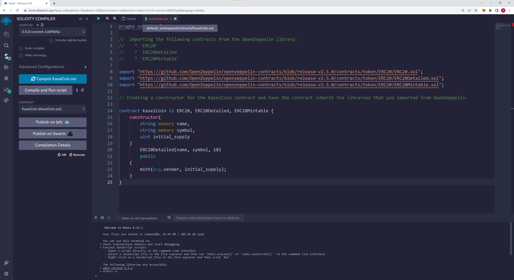

### Compilation of Kasei Crowdsale Code

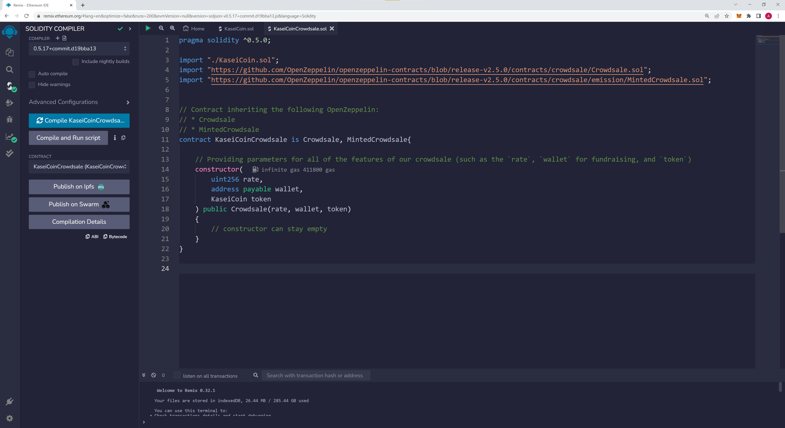

### Adding Crowdsale Deployer Code

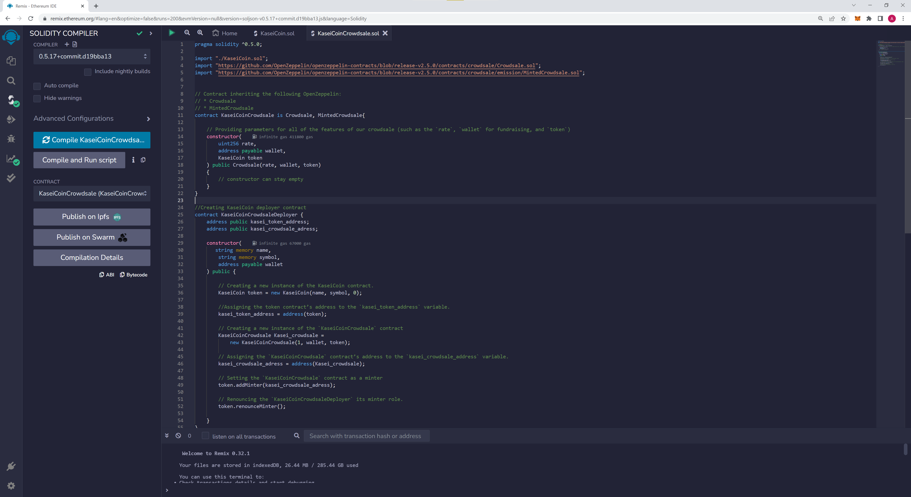

## Testing Code using Metamask connected to Ganache

### Signing in to Metamask and testing connection

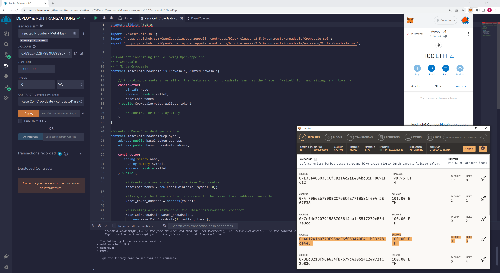

### Deploying Crowdsale Deployer

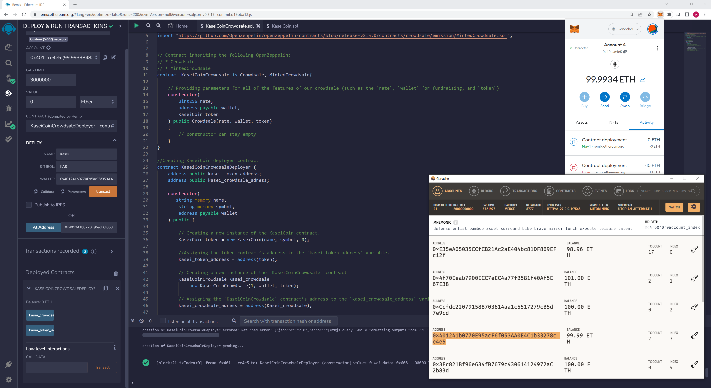

### Testing Buying of Tokens with Deployed Contract - (Buying 4200000 WEI)

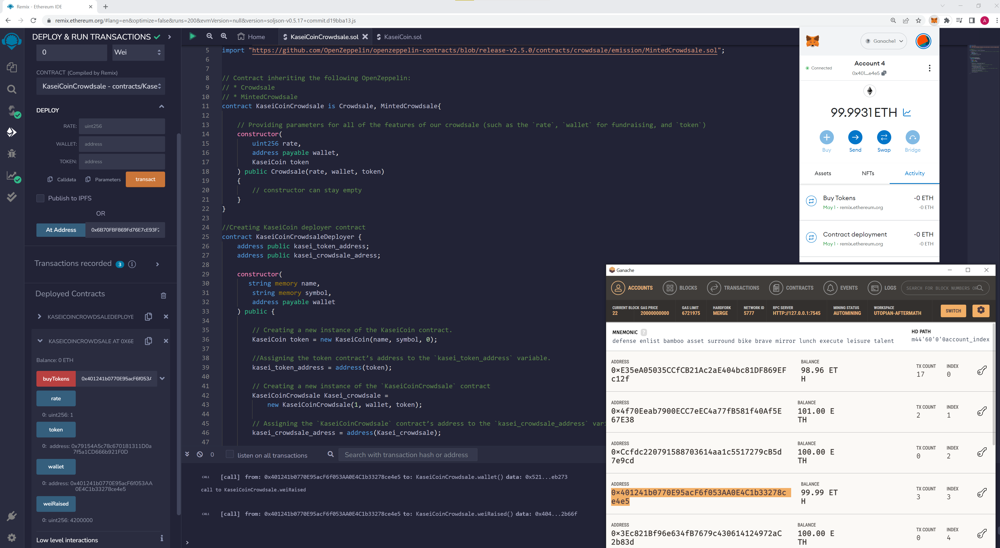

### Continue Testing Buying of Tokens with Deployed Contract - (Buying 2 ETH)

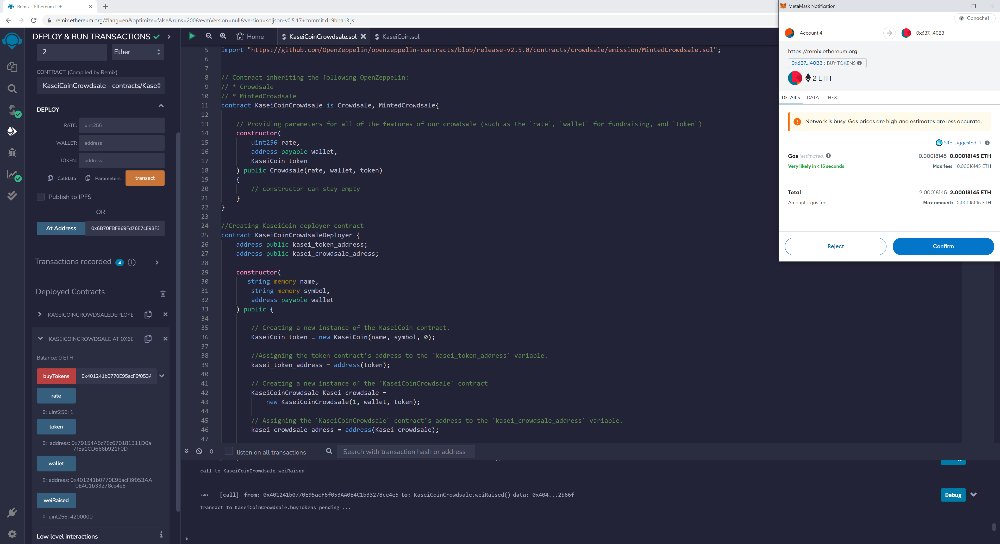
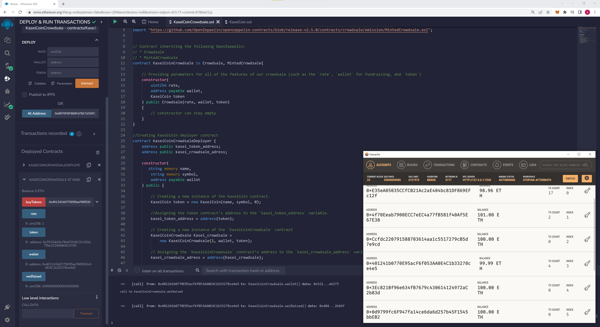

### Deploying Token Contract - Setting Initial Supply to 3 ETH

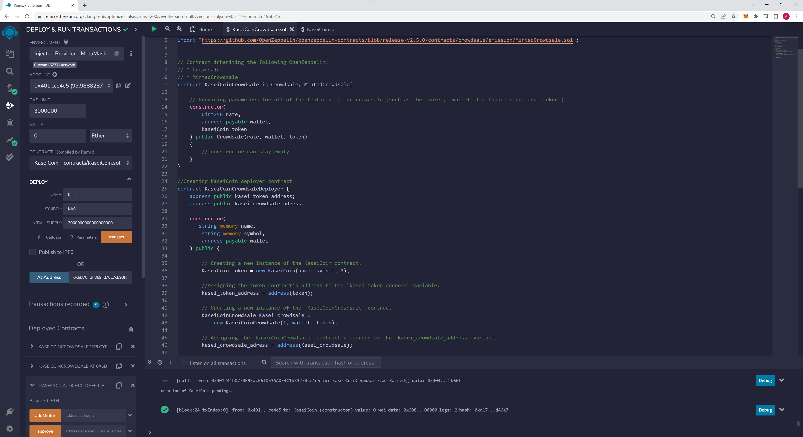

### Testing of Minting Coins - (Minting 777777 WEI)

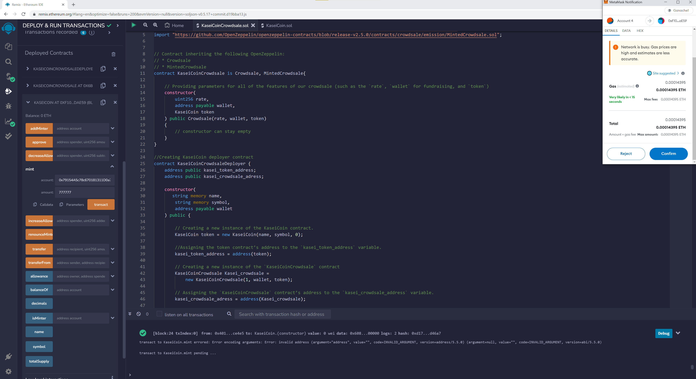
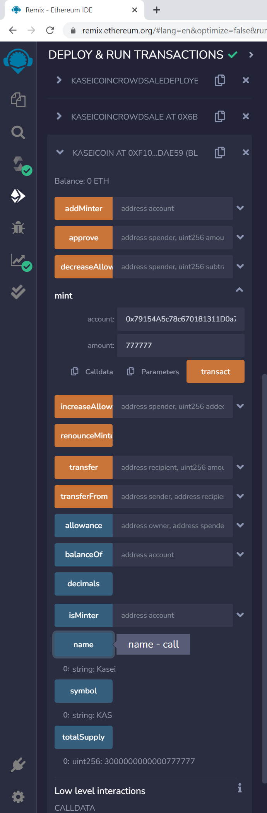

